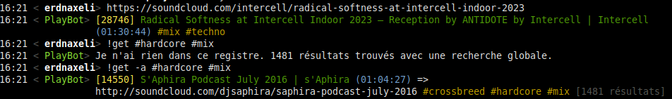

# PlayBot

This is an IRC bot used to save music links posted. It currently supports:

* Bandcamp
* SoundCloud
* YouTube

## The bot

The bot is used to share music.
You can post a link to a supported website and it will:

* extract the music content
* save it in a database
* save any additional tags given with `#`

You can then:

* save a music into your favorites with `!fav`
* search a music with `!get some query #with #tags` (or get a random music if called without search parameters)
* get info about a music: when it was shared for the first time, by whom, how many times it was shared again

See this example of interaction:


The second message from the bot is telling that it cannot find anything in the current channel with those search parameters but that results have been found using a global search.

A website also exists to go through a channel history or see your personal favorites.
This part will need a complete rewrite and rethinking from scratch.

## Commands

### Post a track

Whenever a link to a supported website is posted, it is saved for the current channel, with its information and the name of the poster in the channel and the current date.

Tags can be added in the same message to be saved to. They must start with the character `#`.

Examples:

* `listen to this track, so nice! https://www.youtube.com/watch?v=GGX110-07F8`: it will save the track without tags.
* `some great #industrial #hardcore <3 https://soundcloud.com/angerfistmusic/deathmask-with-drokz-tripped-1`: it will save the track with the tags `#industrial` and `#hardcore`.
* `this guy is having a good time :') !https://www.youtube.com/watch?v=EzmbT9cFJkk`: the link will be ignored.

To post a link **without** it to be saved, it must be prefixed with a character `!`.

### `!get [-a] [ID] [QUERY]`

Get a track from the saved ones.

`ID` is an optional track id.
If provided, the corresponding track is returned, ignoring if it was posted on the current channel or not.
Any given query is ignored.

`QUERY` is an optional query.
If not provided it returns a random music.
The query can use words that will be matched agains the tracks authors and named, and tags.

* `-a`: search in all the channel. If not provided, search only of the current channel.
The query is optional, if not provided a random music posted in the channel is returned.

Example:

* `!get`: return a random track posted on the current channel.
* `!get -a #hardcore death angerfirst`: return a random track posted on any channel, with the tag `#hardcore`, with the author or the name matching `death` and matching `angerfist`.

### `!tag [ID] TAGS`

Tag a track with the given tags.

`ID` is optional. If not given, the last posted track is tagged.

`TAGS` is a list of one or more tags, separated by spaces. Tags can start with `#`, or not.

* `!tag #hardstyle`: tag the last posted track with the tag `#hardstyle`.
* `!tag 2342 #liquid #dnb`: tag the tracks 2342 with the tags `#liquid` and `#dnb`.

### `!fav [ID]`

Save a track in your favorite tracks.

`ID` is optional. If not given, the last posted track is saved to the favorites.

### Referring a previous track

Whenever a command is accepting an `ID` parameter, you can give it a relative id instead of an absolute one.
The form is `-X`.
`-1` refers to the before last track, `-2` to the before before last, etc, up to `-10`.

Examples:

* `!tag -1 #techno`: tag the before last track with the tag `#techno`.
* `!fav -2`: save the before before last track to the user favorites.

## Hosting an instance of the bot

There is currently no binary provided.
You need to clone the repository and build the project yourself.

```shell
$ make
```

It will build two executables: `server` and `ircclient`.

The `ircclient` one is the client connecting to the IRC server.
It sends the messages over HTTP (using protobuf) to the PayBot server.

The `server` executable is the PlayBot server.
It parses IRC messages received over HTTP and executes corresponding commands.
The server runs on localhost on the port 1111, this is currently not configurable.

Both executables need to have access to a configuration file named `playbot.conf`, in the folder where they are executed.
You can find an example of the expected configuration in the file `example.conf`.

Having such a client / server architecture allow to deploys a new version of the server without restarting the client, and thus without disconnecting the bot from IRC.
Note however that if the server if offline, IRC messages received during this time will be discarded.
